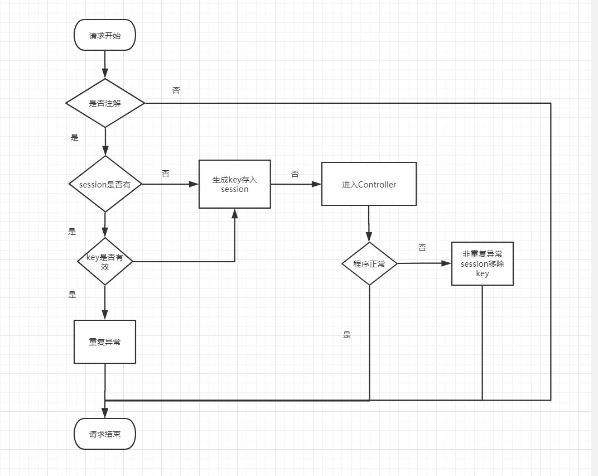
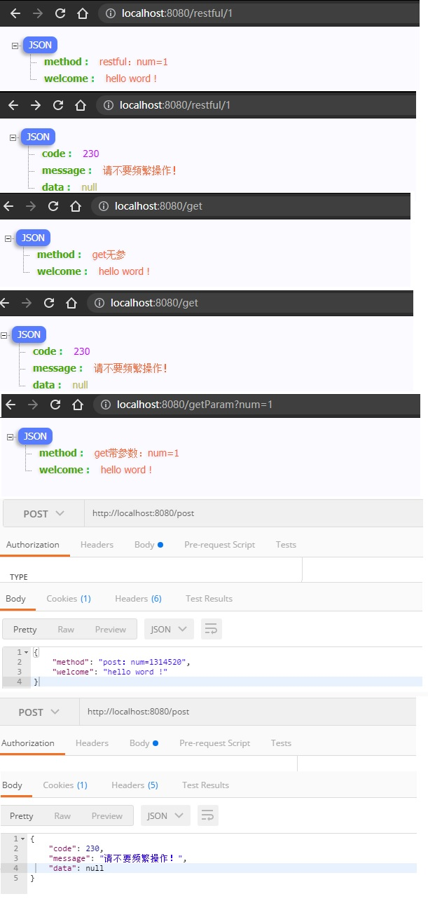

相关资料请参照

#### SpringBoot防止重复请求，重复表单提交超级简单的注解实现之一(初级版)
https://blog.csdn.net/u013042707/article/details/80521418

#### SpringBoot防止重复请求，重复表单提交超级简单的注解实现之二（改进版）
https://blog.csdn.net/u013042707/article/details/80524617

#### SpringBoot防止重复请求，重复表单提交超级简单的注解实现之三（升级版1）
https://blog.csdn.net/u013042707/article/details/80526454

#### SpringBoot防止重复请求，重复表单提交超级简单的注解实现之三（升级版2）
https://blog.csdn.net/u013042707/article/details/80539422

#### SpringBoot防止重复请求，重复表单提交超级简单的注解实现之四（终极版I）
https://blog.csdn.net/u013042707/article/details/80669920

# SpringBoot防止重复请求，重复表单提交超级简单的注解实现之四（终极版II）
## 前言：
根据最新spring boot:2.5.0版本和在《SpringBoot防止重复请求，重复表单提交超级简单的注解实现之四（终极版I）》之上化繁为简抽取更实用的代码，新增超时机制
## 防重复提交业务流程图如下


## 1.简化DuplicateSubmitToken.java代码，只留下标记接口，新增超时设置接口
```java
/**
 * @author 猿份哥
 * @description 防止表单重复提交注解
 */
@Retention(RetentionPolicy.RUNTIME)
@Target(ElementType.METHOD)
@Documented
public @interface DuplicateSubmitToken {
    /**
     * 保存重复提交标记 默认为需要保存
     */
    boolean save() default true;

    /**
     * 重复失效时间单位毫秒，默认5000毫秒
     * @return
     */
    long  timeOut() default 5000 ;
}
```

## 2.改造DuplicateSubmitAspect.java新增超时判断代码
```java
/**
 * @author 猿份哥
 * @description 防止表单重复提交拦截器
 */
@Aspect
@Component
@Slf4j
public class DuplicateSubmitAspect {
    public static final String DUPLICATE_TOKEN_KEY = "duplicate_token_key";

    @Pointcut("execution(public * com.yuanfenge.springboot.duplicatesubmit.controller..*(..))")

    public void webLog() {
    }

    @Before("webLog() && @annotation(token)")
    public void before(final JoinPoint joinPoint, DuplicateSubmitToken token) throws DuplicateSubmitException {
        if (token != null) {
            ServletRequestAttributes attributes = (ServletRequestAttributes) RequestContextHolder.getRequestAttributes();
            HttpServletRequest request = attributes.getRequest();

            boolean isSaveSession = token.save();
            if (isSaveSession) {
                String key = getDuplicateTokenKey(joinPoint);
                Object t = request.getSession().getAttribute(key);
                if (null == t) {
                    createKey(request, key);
                } else if (valid(t,token.timeOut())){
                    throw new DuplicateSubmitException(TextConstants.REQUEST_REPEAT);
                } else {
                    createKey(request, key);
                }
            }

        }
    }

    private void createKey(HttpServletRequest request, String key) {
        String uuid = UUIDUtil.randomUUID();
        long now = System.currentTimeMillis();
        String value = uuid + "_" + now;
        request.getSession().setAttribute(key, value);
        log.info("token-key={};token-value={}",key, value);
    }

    /**
     * 是否超时
     * @param t
     * @return
     */
    private boolean valid(Object t, long timeOut) {
        String token = t.toString();
        String[] arr = token.split("_");
        long before = Long.parseLong(arr[1]);
        long now = System.currentTimeMillis();
        if (now-before<timeOut){
            return true;
        }
        return false;
    }

    /**
     * 获取重复提交key
     * @param joinPoint
     * @return
     */
    public String getDuplicateTokenKey(JoinPoint joinPoint) {

        String methodName = joinPoint.getSignature().getName();
        String args = Arrays.asList(joinPoint.getArgs()).stream().map(i -> String.valueOf(i)).collect(Collectors.joining());
        StringBuilder key = new StringBuilder(DUPLICATE_TOKEN_KEY);
        key.append("_").append(methodName).append(args);
        return key.toString();
    }

    /**
     * 异常
     *
     * @param joinPoint
     * @param e
     */
    @AfterThrowing(pointcut = "webLog()&& @annotation(token)", throwing = "e")
    public void doAfterThrowing(JoinPoint joinPoint, Throwable e, DuplicateSubmitToken token) {
        if (null != token
                && e instanceof DuplicateSubmitException == false) {
            //处理重复提交本身之外的异常
            ServletRequestAttributes attributes = (ServletRequestAttributes) RequestContextHolder.getRequestAttributes();
            HttpServletRequest request = attributes.getRequest();
            boolean isSaveSession = token.save();
            //获得方法名称
            if (isSaveSession) {
                String key = getDuplicateTokenKey(joinPoint);
                Object t = request.getSession().getAttribute(key);
                if (null != t) {
                    //方法执行完毕移除请求重复标记
                    request.getSession(false).removeAttribute(key);
                    log.info("异常情况--移除标记！");
                }
            }
        }
    }
}
```
 
## 3.TestController.java测试:包含restful请求，get请求，post请求
```java

/**
 * @author 猿份哥
 * @description
 */
@RestController
public class TestController {

    @DuplicateSubmitToken
    @RequestMapping(value = "/restful/{num}", method = RequestMethod.GET)
    public Map<String, Object> restful(@PathVariable(value = "num") int num) throws Exception {
        Map<String, Object> map=new HashMap<>();
        if (num == 2) { //手动抛个异常
            throw new Exception("====system exception haha !===");
        }
        map.put("welcome","hello word !");
        map.put("method","restful：num="+num);
        return map;
    }

    @DuplicateSubmitToken
    @RequestMapping(value = "/getParam", method = RequestMethod.GET)
    public Map<String, Object> getParam(@RequestParam(value = "num") int num) throws Exception {
        Map<String, Object> map=new HashMap<>();
        if (num == 2) {
            throw new Exception("====system exception haha !===");
        }
        map.put("welcome","hello word !");
        map.put("method","get带参数：num="+num);
        return map;
    }

    @DuplicateSubmitToken
    @RequestMapping(value = "/get", method = RequestMethod.GET)
    public Map<String, Object> get() throws Exception {
        Map<String, Object> map=new HashMap<>();
        map.put("welcome","hello word !");
        map.put("method","get无参");
        return map;
    }

    /**
     * post请求方式
     * 设置30秒内不允许重复请求
     * @param num
     * @return
     * @throws Exception
     */
    @DuplicateSubmitToken(timeOut = 30*1000)
    @RequestMapping(value = "/post", method = RequestMethod.POST)
    public Map<String, Object> post(@RequestParam(value = "num") int num) throws Exception {
        Map<String, Object> map=new HashMap<>();
        map.put("welcome","hello word !");
        map.put("method","post：num="+num);
        return map;
    }
}
```
## 浏览器测试
http://localhost:8080/restful/1

http://localhost:8080/get?num=1

http://localhost:8080/getParam?num=1

http://localhost:8080/post



​